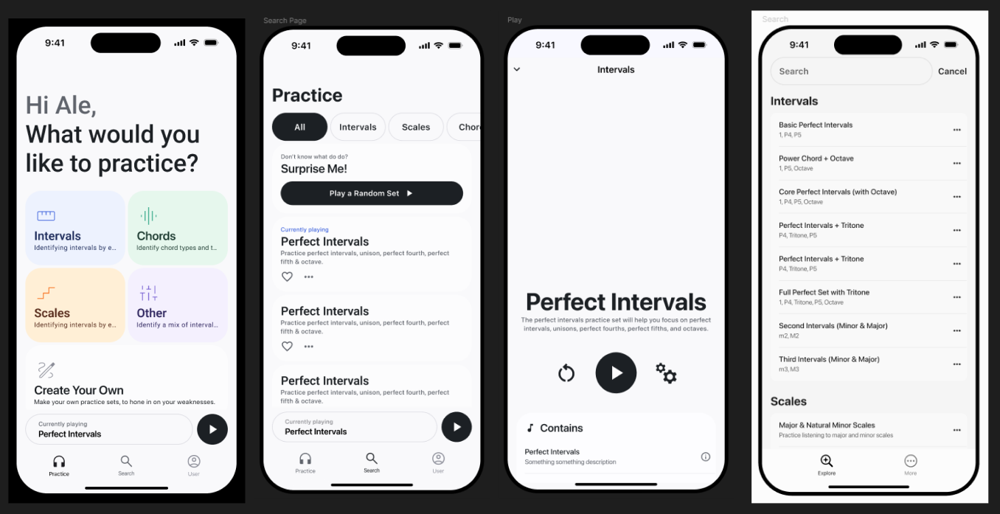

# Tonecast - Handsfree Ear Training

[Watch the demo with audio on Youtube](https://youtube.com/shorts/Vwz9bMXZt5A)

**Tonecast** is a hands-free ear training app designed to help you improve your relative pitch recognition through audio-only practice sets.

The app emphasizes convenience and minimalism. By selecting practice sets that play automatically (like music or a podcast on spotify), you can train your ear while engaging in other activities like cooking, driving, or doing chores. There is no need to interact with your phone once the exercise has started. Tonecast respects your privacy: it collects no user data and currently does not track progress or usage statistics.

**Note:** This repository outlines the functionality of Tonecast as well as gives a preview of the WIP. The full codebase is private, as we intend to bring the app to market in the future.

## Index

- [Visual Preview (Early Concepts / In Progress)](#visual-preview-early-concepts--in-progress)
- [Feature Overview](#feature-overview)
- [Features Detailed](#features-detailed)
  - [Practice Set Discovery](#practice-set-discovery)
  - [Practice Set Playback](#practice-set-playback)
  - [Musical Structures](#musical-structures)
  - [Local Storage Backend](#local-storage-backend)
  - [Clean Architecture](#clean-architecture)
  - [Tagging System](#tagging-system)
  - [Audio Engine](#audio-engine)
- [Planned Features / Future Releases](#planned-features--future-releases)
  - [CarPlay Support](#carplay-support)
  - [Siri Integration](#siri-integration)
  - [Custom Practice Sets](#custom-practice-sets)
  - [Variable Musical Notation](#variable-musical-notation)

## Visual Preview (Early Concepts / In Progress)
Note that the video below is from a work in progress version of the applciation. Many things are still subject to change.

## Feature Overview

| Area                  | Key Features                                                                 |
|-----------------------|------------------------------------------------------------------------------|
| Practice Discovery    | Browse and filter sets, fuzzy search, view details, seamless navigation      |
| Playback              | Start/stop, random examples, answer reveal, multiple playback modes          |
| Musical Structures    | Supports intervals, chords, scales, and modes                                |
| Playback Modes        | Ascending, Descending, Harmonic                                              |
| Storage               | Offline-first, NoSQL backend, ORM structure definitions                      |
| Architecture          | Flutter + Dart, BLoC state management, modular monorepo                      |
| Tag System            | Organize/filter sets and structures by tags                                  |
| Audio Engine          | Real-time playback via MIDI and generated tts          

## Features Detailed

### Practice Set Discovery

- [X] Browse available practice sets with name and short description  
- [X] Filter sets by category (e.g., Chords, Scales, Intervals)  
- [X] Navigate between list and detail views seamlessly  
- [X] Persistent play/stop control accessible from all views
- [ ] Fuzzy search bar with typo-tolerant matching  
- [ ] View full practice set details including description and musical structures  

### Practice Set Playback

- [X] Start playback of selected practice sets  
- [X] Randomly choose musical structure and generate an example sequence  
- [X] Play each example 3 times  
- [X] Announce the correct answer after playback  
- [X] Musical Structure Playback modes:
  - [X] Ascending  
  - [X] Descending  
  - [X] Harmonic (if supported)
- [X] Practice Set Playback modes: 
  - [X] Sequential (10 per mode, skips unsupported modes)  
  - [X] Shuffle (randomized, respects support constraints) 
- [X] Stop button halts audio and resets session

### Musical Structures

- [X] Support for a wide range of musical concepts:
  - [X] Intervals (e.g., M3, P5, Tritone)  
  - [X] Chords (e.g., Major, Minor, Diminished, 7ths, Extended)  
  - [X] Scales (e.g., Major, Minor, Blues)  

### Local Storage Backend

- [X] Fully offline storage using NoSQL (e.g., ObjectBox)  
- [X] All data defined via ~JSON~ ORM (extensible, structured)  
- [X] Supports migrations and robust query system  

### Clean Architecture

- [X] Flutter frontend + Dart backend package (modular monorepo)  
- [X] BLoC state management with crash recovery support  
- [X] ~JSON-based~ ORM data models for musical structures and practice sets

### Tagging System

- [X] Tags for organizing practice sets and structures (e.g., “triad”, “scale”, “chord”)  
- [X] Useful for filtering and categorizing UI elements  

### Audio Engine

- [X] Plays musical structures in real-time using MIDI or generated audio  
- [ ] Future support for:
  - [ ] Tempo control  
  - [ ] Repetition count  
  - [ ] Preferred instrument  
  - [ ] Octave selection  

## Planned Features / Future Releases
### CarPlay Support

- [ ] Simplified CarPlay interface with browsing and playback  
- [ ] Fully compliant with Apple’s CarPlay safety guidelines  

### Siri Integration

- [ ] Start/stop practice sets via voice command  
- [ ] e.g., “Hey Siri, play Major Triads using Audio Trainer”  

### Custom Practice Sets

- [ ] Users can create their own practice sets  
- [ ] Name custom sets and choose included musical structures  
- [ ] Custom sets are filterable and appear alongside standard sets  

### Variable Musical Notation

- [ ] Select preferred notation formats (e.g., m2, min2, ii)  
